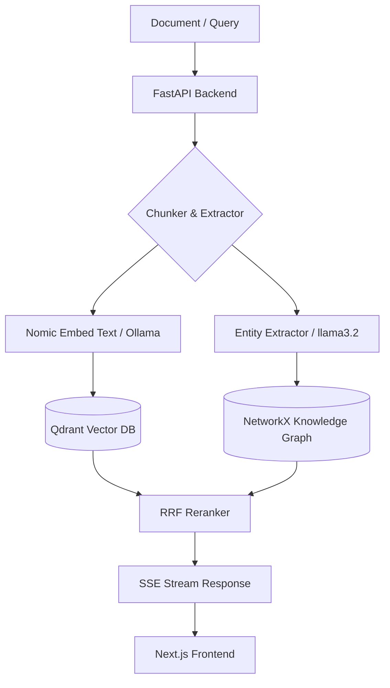

# GRAG — Mini Semantic Search & GraphRAG System

<p align="center">
  
  
  
  
  
  
</p>

> **Disclaimer:** This is an ongoing personal side project and **Vibe Coding** experiment exploring hybrid RAG architecture (Vector Search + Knowledge Graph). Features are continuously refined.

---

## Features

- **Document Ingestion** — Upload PDF, DOCX, TXT, and Markdown files.
- **Header-Aware Chunking** — Splits text based on Markdown headings (`#`, `##`, `###`) while retaining section context.
- **SSE Token Streaming** — Streams answer tokens from Ollama to the browser interface via Server-Sent Events.
- **RRF & Graph Retrieval** — Combines vector search results and 2-hop graph node traversal using Reciprocal Rank Fusion.
- **Document & Citation Viewer** — A slide-over panel to view document chunks, highlight cited text, and open original files.
- **Dual Vector Storage Mode** — Supports local disk storage (`data/qdrant_storage`) or Qdrant Cloud via environment variables.
- **Graph Visualizer** — D3.js visualization for extracted entities and relations with search and type filters.
- **Local History** — Saves chat history in browser `localStorage`.
- **Agent Workspace** — Creates grounded reports, plans, tables, and charts and exports them as Markdown, CSV, Excel, PDF, or SVG.
- **Docker Compose Setup** — Container configuration files included for deployment.

---

## 🎨 Vibe Coding Guide (AI Pair Programming Workflow)

This project was built iteratively using AI Pair Programming (Vibe Coding). If you want to continue extending or modifying this project with AI agents (Antigravity, Cursor, Copilot, etc.), follow these guidelines:

1. **Keep Development Servers External:**
   - Run `npm run dev` and `python -m uvicorn app.main:app` in external terminal windows rather than background AI tool calls to prevent file watcher lock collisions (`WatchFiles`/`Turbopack`).
2. **Iterative Feature Branching:**
   - Prompt the AI for single, modular UI or backend components (e.g., "Add slide-over drawer", "Add filter dropdown").
3. **Verify Before Commit:**
   - Run `npm run build` or short Python check scripts after multi-file edits before committing.
4. **Handoff Files:**
   - Check `.agents/doc/context-snapshot.md` and `AGENTS.md` to quickly align the AI agent on the current project state.

---

## Architecture Flow



---

## Quick Start

### Prerequisites

- **Python 3.11+**
- **Node.js 20+**
- **Ollama** ([Installation guide](https://ollama.ai))

### 1. Pull Models

```bash
ollama pull nomic-embed-text
ollama pull llama3.2
```

### 2. Backend Setup

```bash
cd backend
python -m venv .venv

# Activate virtual environment
# Windows: .\.venv\Scripts\Activate.ps1
# Linux/macOS: source .venv/bin/activate

pip install -r requirements.txt
python -m uvicorn app.main:app --port 8000 --reload
```

### 3. Frontend Setup

```bash
cd frontend
npm install
npm run dev
```

Open `http://localhost:3000` in your browser.

---

### 4. Running Tests

```bash
cd backend
python -m unittest discover -s tests
```

---

## Offline Evaluation

Run deterministic evaluation through `POST /api/v1/evaluation/run`:

```json
{
  "cases": [
    {
      "question": "Who manages Project Alpha?",
      "retrieved_chunk_ids": ["chunk-1", "chunk-2"],
      "relevant_chunk_ids": ["chunk-2"],
      "answer": "Alice manages Project Alpha.",
      "reference_answer": "Project Alpha is managed by Alice."
    }
  ]
}
```

The response includes per-case and aggregate precision, recall, retrieval F1,
hit rate, reciprocal rank, and Unicode-aware answer token F1. Keep labelled
datasets in `data/evaluation/` and compare these metrics before and after changes
to chunking, graph extraction, prompts, or retrieval.

Run the checked-in regression gate directly:

```bash
cd backend
python scripts/evaluate_golden.py evaluation/golden.sample.json
```

The evaluator reports NDCG/MRR/Recall, answer overlap, citation precision and
recall, no-answer accuracy, plus graph entity/relation extraction metrics.
Replace the sample with a reviewed domain dataset before tuning thresholds.

## Advanced RAG pipeline

Retrieval now combines independent dense, Unicode-aware BM25, and graph-ranked
lists with weighted reciprocal-rank fusion. Candidates are reranked with the
multilingual Ollama reranker (or a configured local CrossEncoder, with a deterministic
lexical fallback), then expanded from precise child chunks to coherent parent sections.

PDF ingestion preserves real page numbers and tables and can OCR scanned pages.
OCR requires the Tesseract executable and the `vie`/`eng` language packs on the
host. Graph relations retain document/chunk provenance, evidence, confidence,
and optional validity dates. Generated answers are verified claim by claim and
fall back to a no-answer response when evidence is below the configured gate.

Existing indexed documents must be re-indexed once to populate the structural
metadata and remove old TOC chunks/noisy graph identities. Re-indexing replaces
the stored chunks, vectors, and graph provenance for every uploaded document:

```bash
cd backend
python scripts/reindex_all.py --yes
```

The API also exposes `POST /api/v1/documents/{document_id}/reindex` for a single
document. New documents record an index schema version so stale indexes are
visible in the document/status responses.

Confidence is intentionally reported as uncalibrated until reviewed outcomes
are available. Label at least 20 answers (including both correct and incorrect
ones) with `evidence_score`, `groundedness_score`, and `is_correct`, then fit and
save the calibration model:

```bash
cd backend
python scripts/calibrate_confidence.py data/evaluation/reviewed.json \
  --output data/evaluation/confidence_calibration.json
```

Restart the backend after producing the calibration file. API responses expose
`confidence_calibrated` so callers can distinguish learned probabilities from
the conservative fallback score.

## Agent Workspace

Open `http://localhost:3000/agent` to create a grounded work product from the
indexed knowledge base. The backend stores bounded run history and generated
artifacts under `data/outputs`; external actions remain disabled by default and
require explicit approval when an integration is added.

Agent API endpoints are available under `/api/v1/agent`, including capabilities,
run history, artifact download, and the product-creation endpoint. Excel and PDF
generation use `openpyxl` and `reportlab`, both declared in backend requirements.

---

## Docker Setup

```bash
docker compose up -d
```

---

## Project Structure

```text
GRAG/
├── backend/
│   ├── app/          # Document, search, graph, evaluation, and Agent routes
│   │   ├── services/ # RAG services and bounded Agent orchestrator/artifact writers
│   │   └── main.py   # FastAPI application with fault-tolerant lifespan & health check
│   ├── tests/        # Unit tests for Chunker, RRF, and Citations
│   ├── pyproject.toml # Linter & pytest configurations
│   ├── Dockerfile
│   └── requirements.txt
├── .github/
│   └── workflows/
│       └── ci.yml    # GitHub Actions automated CI testing pipeline
├── frontend/
│   ├── src/
│   │   ├── app/          # Dashboard, chat, Agent, search, graph pages
│   │   ├── components/   # UI components (DocumentDrawer, GraphVisualizer)
│   │   └── lib/          # API client
│   ├── Dockerfile
│   └── package.json
├── scripts/
│   └── migrate_to_cloud.py  # Local to Qdrant Cloud migration script
├── docker-compose.yml
├── HANDOVER.md
├── LICENSE
└── README.md
```

---

## License

CC BY-NC 4.0 License (Non-Commercial). See [LICENSE](LICENSE) for details.

Project	Service	Status	URL
mini-graphrag	Frontend	✅ Up	http://localhost:3000
mini-graphrag	Backend	✅ Up	http://localhost:8000/docs
mini-graphrag	Qdrant	✅ Healthy	http://localhost:6333/dashboard
rag-production-template	API	✅ Healthy	http://localhost:8001/docs
rag-production-template	Qdrant	✅ Up	http://localhost:6335/dashboard

Frontend App: http://localhost:3000
Backend API Docs: http://localhost:8000/docs
Neo4j Browser UI: http://localhost:7474 (User: neo4j, Password: grag_password_2024)
