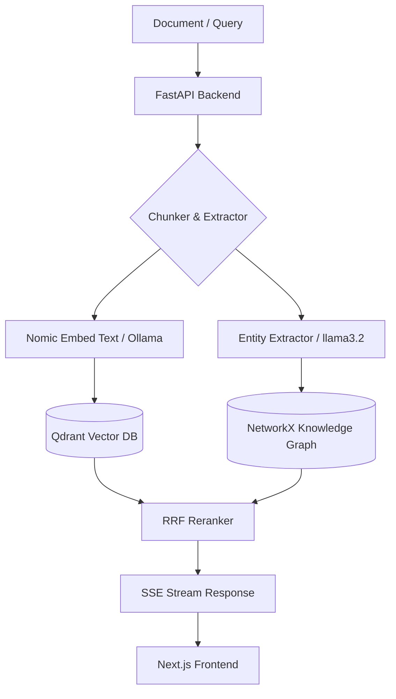

# GRAG — Mini Semantic Search & GraphRAG System

<p align="center">
  
  
  
  
  
  
</p>

> **Disclaimer:** This is an ongoing personal side project and **Vibe Coding** experiment exploring hybrid RAG architecture (Vector Search + Knowledge Graph). Features are continuously refined.

---

## Features

- **Document Ingestion** — Upload PDF, DOCX, TXT, and Markdown files.
- **Header-Aware Chunking** — Splits text based on Markdown headings (`#`, `##`, `###`) while retaining section context.
- **SSE Token Streaming** — Streams answer tokens from Ollama to the browser interface via Server-Sent Events.
- **RRF & Graph Retrieval** — Combines vector search results and 2-hop graph node traversal using Reciprocal Rank Fusion.
- **Document & Citation Viewer** — A slide-over panel to view document chunks, highlight cited text, and open original files.
- **Dual Vector Storage Mode** — Supports local disk storage (`data/qdrant_storage`) or Qdrant Cloud via environment variables.
- **Graph Visualizer** — D3.js visualization for extracted entities and relations with search and type filters.
- **Local History** — Saves chat history in browser `localStorage`.
- **Docker Compose Setup** — Container configuration files included for deployment.

---

## 🎨 Vibe Coding Guide (AI Pair Programming Workflow)

This project was built iteratively using AI Pair Programming (Vibe Coding). If you want to continue extending or modifying this project with AI agents (Antigravity, Cursor, Copilot, etc.), follow these guidelines:

1. **Keep Development Servers External:**
   - Run `npm run dev` and `python -m uvicorn app.main:app` in external terminal windows rather than background AI tool calls to prevent file watcher lock collisions (`WatchFiles`/`Turbopack`).
2. **Iterative Feature Branching:**
   - Prompt the AI for single, modular UI or backend components (e.g., "Add slide-over drawer", "Add filter dropdown").
3. **Verify Before Commit:**
   - Run `npm run build` or short Python check scripts after multi-file edits before committing.
4. **Handoff Files:**
   - Check `.agents/doc/context-snapshot.md` and `AGENTS.md` to quickly align the AI agent on the current project state.

---

## Architecture Flow



---

## Quick Start

### Prerequisites

- **Python 3.11+**
- **Node.js 20+**
- **Ollama** ([Installation guide](https://ollama.ai))

### 1. Pull Models

```bash
ollama pull nomic-embed-text
ollama pull llama3.2
```

### 2. Backend Setup

```bash
cd backend
python -m venv .venv

# Activate virtual environment
# Windows: .\.venv\Scripts\Activate.ps1
# Linux/macOS: source .venv/bin/activate

pip install -r requirements.txt
python -m uvicorn app.main:app --port 8000 --reload
```

### 3. Frontend Setup

```bash
cd frontend
npm install
npm run dev
```

Open `http://localhost:3000` in your browser.

---

### 4. Running Tests

```bash
cd backend
python -m unittest discover -s tests
```

---

## Docker Setup

```bash
docker compose up -d
```

---

## Project Structure

```text
GRAG/
├── backend/
│   ├── app/          # Document, search, and graph routes
│   │   ├── services/ # Chunker, RAG pipeline, vector store, graph builder
│   │   └── main.py   # FastAPI application with fault-tolerant lifespan & health check
│   ├── tests/        # Unit tests for Chunker, RRF, and Citations
│   ├── pyproject.toml # Linter & pytest configurations
│   ├── Dockerfile
│   └── requirements.txt
├── .github/
│   └── workflows/
│       └── ci.yml    # GitHub Actions automated CI testing pipeline
├── frontend/
│   ├── src/
│   │   ├── app/          # Dashboard, chat, search, graph pages
│   │   ├── components/   # UI components (DocumentDrawer, GraphVisualizer)
│   │   └── lib/          # API client
│   ├── Dockerfile
│   └── package.json
├── scripts/
│   └── migrate_to_cloud.py  # Local to Qdrant Cloud migration script
├── docker-compose.yml
├── HANDOVER.md
├── LICENSE
└── README.md
```

---

## License

CC BY-NC 4.0 License (Non-Commercial). See [LICENSE](LICENSE) for details.
