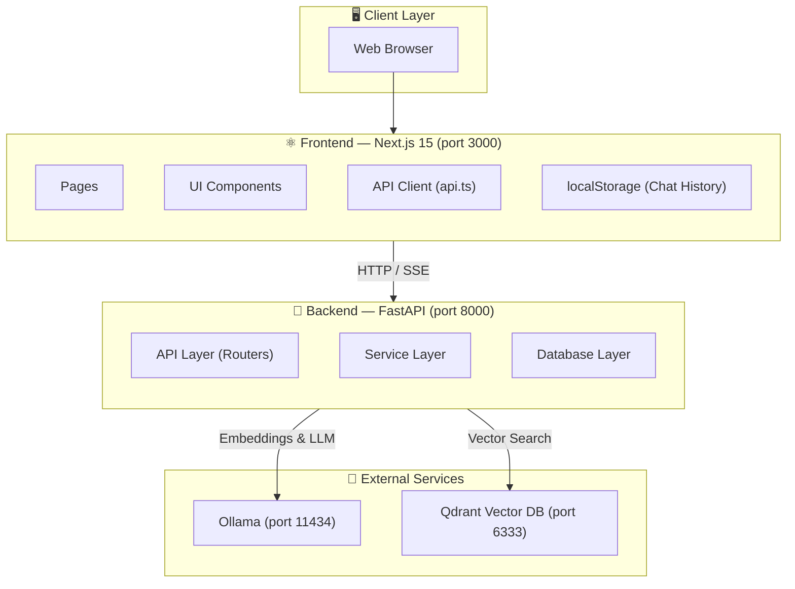
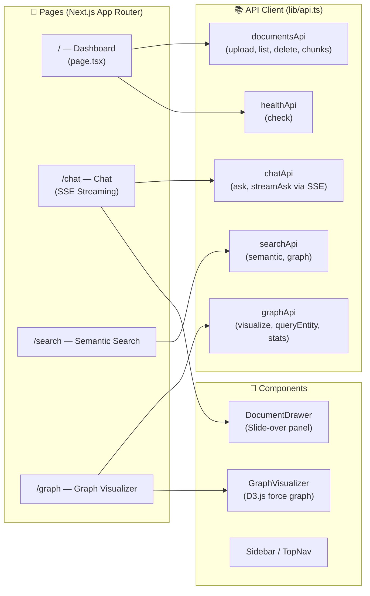
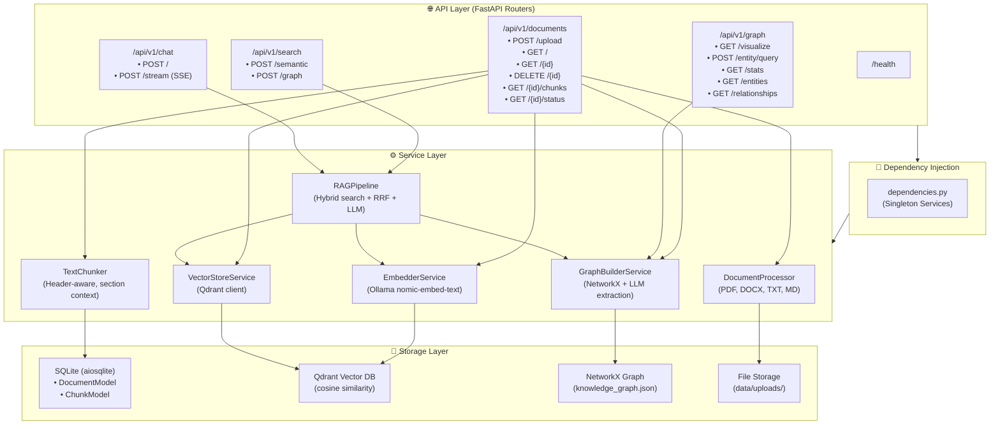
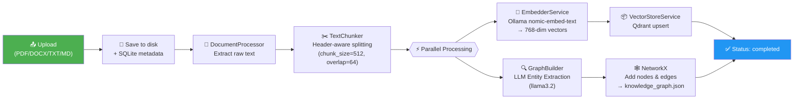
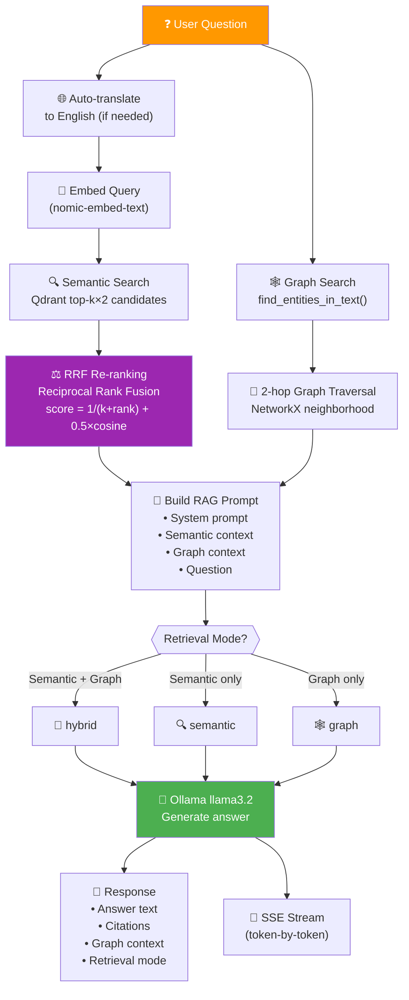
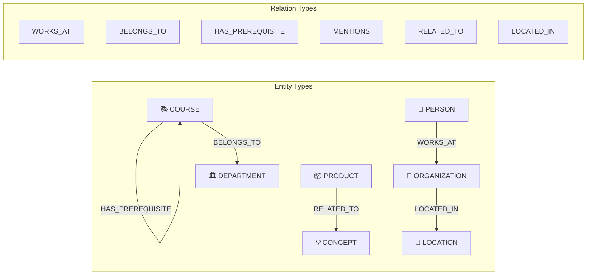
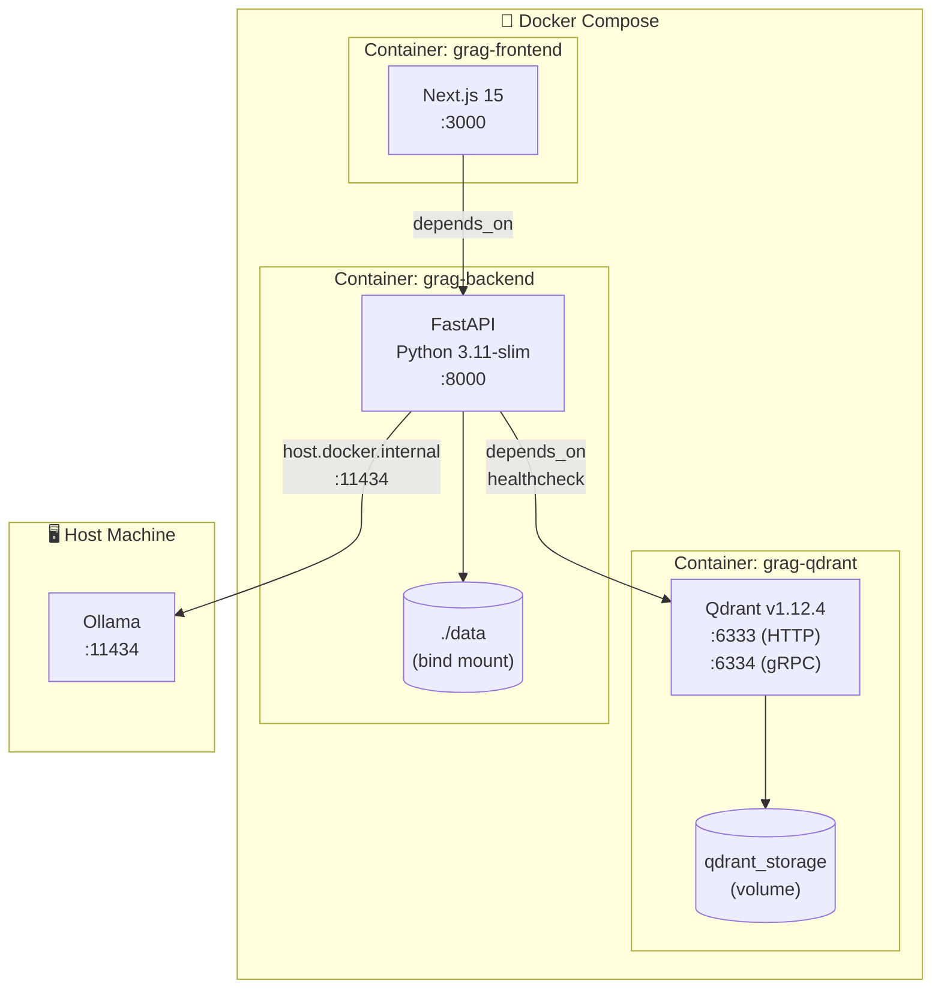
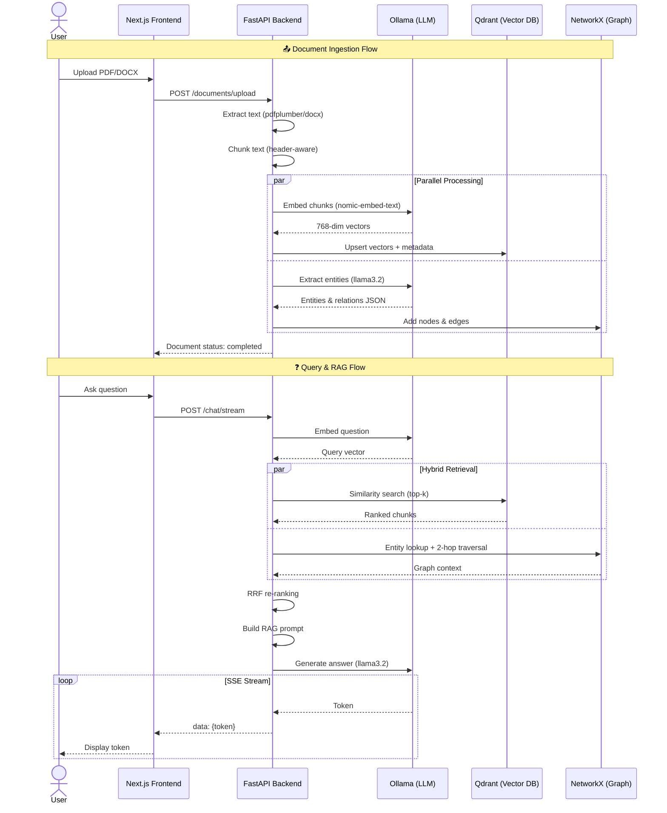

# GRAG — Mini GraphRAG Architecture

## 1. System Overview



---

## 2. Frontend Architecture



---

## 3. Backend Architecture



---

## 4. Document Ingestion Pipeline



---

## 5. Query & RAG Pipeline (Hybrid GraphRAG)



---

## 6. Knowledge Graph Structure



---

## 7. Technology Stack

| Layer | Technology | Purpose |
|-------|-----------|---------|
| **Frontend** | Next.js 15, React 19, TypeScript | UI Framework |
| **UI Components** | Lucide React (icons) | Icon library |
| **Graph Viz** | D3.js v7 | Force-directed graph visualization |
| **Styling** | TailwindCSS v4 | Utility-first CSS |
| **Backend** | FastAPI, Uvicorn | REST API + SSE streaming |
| **ORM** | SQLAlchemy 2.0 + aiosqlite | Async SQLite access |
| **Embeddings** | Ollama + nomic-embed-text | 768-dim dense vectors |
| **LLM** | Ollama + llama3.2 (3B) | Text generation & entity extraction |
| **Vector DB** | Qdrant | Cosine similarity search |
| **Knowledge Graph** | NetworkX | In-memory directed graph (JSON persistence) |
| **Doc Parsing** | pdfplumber, python-docx | PDF & DOCX extraction |
| **Containerization** | Docker Compose | Multi-service orchestration |

---

## 8. Docker Deployment Architecture



---

## 9. Data Flow Summary



---

## 10. Evaluation & Maintenance

Labelled cases are evaluated through `POST /api/v1/evaluation/run`. Retrieval
quality uses precision, recall, F1, hit rate, and reciprocal rank; answer overlap
uses Unicode-aware token F1. Runtime latency, confidence, routing distribution,
and errors are available under `/api/v1/monitoring/*`.

```text
Labelled dataset -> offline evaluation -> error analysis
-> tune chunking/schema/retrieval/prompt -> re-index -> compare regression metrics
```
